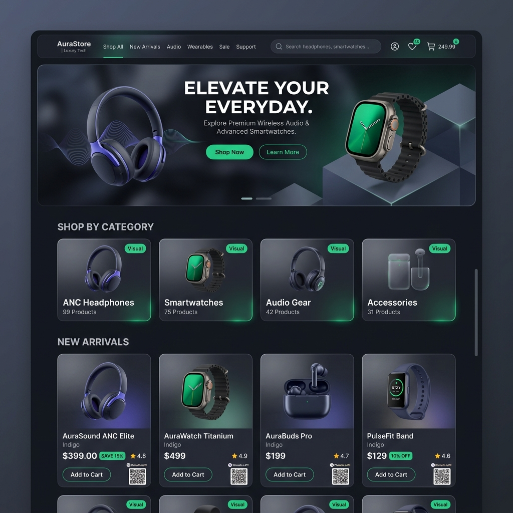

# AuraStore — Full-Stack MERN E-Commerce Platform



A production-ready, secure, responsive full-stack e-commerce web application built using the **MERN Stack** (MongoDB, Express.js, React, Node.js), Redux Toolkit, Tailwind CSS, PhonePe UPI QR payment processing, and visual analytics.

---

## 🌟 Tech Stack

- **Frontend**: React 18, Vite, Redux Toolkit, React Router v6, Tailwind CSS, Lucide Icons, Recharts
- **Backend**: Node.js v24, Express.js REST API
- **Database**: MongoDB & Mongoose ODM (Supports MongoDB Atlas, Local MongoDB, & zero-config in-memory fallback)
- **Authentication**: JSON Web Tokens (JWT Bearer tokens), bcryptjs password hashing, Role-Based Access Control (RBAC)
- **Payment Gateway**: Stripe API integration + built-in interactive payment simulator
- **File Storage**: Multer file uploads with Cloudinary support
- **Security**: Helmet, CORS, Express Rate Limiter, Express-Validator input sanitization

---

## 📁 Project Folder Structure

```text
E-Commerce Website/
├── client/                      # React (Vite) Frontend Application
│   ├── src/
│   │   ├── components/          # Navbar, Footer, ProductCard, ProductFilter, Rating, Pagination, AdminLayout...
│   │   ├── pages/               # HomePage, ShopPage, ProductDetailPage, CartPage, WishlistPage, CheckoutPage...
│   │   │   └── admin/           # DashboardPage, ProductsAdminPage, CategoriesAdminPage, OrdersAdminPage...
│   │   ├── store/               # Redux Slices (auth, cart, wishlist, product, order, admin)
│   │   ├── App.jsx              # Main Router Configuration
│   │   ├── main.jsx             # React Provider entry point
│   │   └── index.css            # Tailwind CSS directives
│   ├── package.json
│   └── vite.config.js
│
├── server/                      # Express / Node.js REST API Backend
│   ├── src/
│   │   ├── config/              # Database connection (db.js)
│   │   ├── controllers/         # Auth, Product, Category, Order, Review, Coupon, Analytics controllers
│   │   ├── middleware/          # Auth JWT protect/admin, Error middleware, Multer upload, Validation
│   │   ├── models/              # User, Product, Category, Order, Review, Coupon Mongoose schemas
│   │   ├── routes/              # Express REST routes
│   │   ├── utils/               # Token generator & Seeder script
│   │   └── server.js            # Express server initialization
│   ├── uploads/                 # Local media upload storage
│   └── package.json
└── README.md
```

---

## 🚀 Quickstart & Setup Guide

### 1. Prerequisites
- Node.js (v18 or higher) & `npm`
- MongoDB instance (MongoDB Atlas cluster or local MongoDB daemon `mongodb://127.0.0.1:27017`). *Note: If no MongoDB server is running locally, the server automatically starts an in-memory MongoDB runner so you can test instantly without setup!*

### 2. Backend Setup
```bash
cd server
npm install
node src/utils/seeder.js     # Seeds initial products, categories, admin & customer users
npm run dev                  # Starts server on http://localhost:5000
```

### 3. Frontend Setup
Open a second terminal window:
```bash
cd client
npm install
npm run dev                  # Starts React Vite app on http://localhost:3000
```

Visit **http://localhost:3000** in your browser!

---

## 🔑 Test Credentials

| Account Role | Email Address | Password | Privileges |
| :--- | :--- | :--- | :--- |
| **Administrator** | `admin@example.com` | `password123` | Full Admin Dashboard, Sales Analytics Charts, Product/Category/Order/User Management |
| **Customer** | `user@example.com` | `password123` | Catalog Browsing, Shopping Cart, Wishlist, Address Management, Order Checkout & Tracking |

---

## 📑 API Endpoint Documentation

### Authentication (`/api/auth`)
- `POST /api/auth/register` — Register a new customer account
- `POST /api/auth/login` — Login & retrieve JWT Bearer token
- `GET /api/auth/profile` — Get logged-in user details (Protected)
- `PUT /api/auth/profile` — Update user profile details (Protected)
- `POST /api/auth/address` — Add shipping address to address book (Protected)
- `GET /api/auth/users` — Fetch customer directory (Admin Only)
- `PUT /api/auth/users/:id/block` — Toggle block/suspend user (Admin Only)

### Products (`/api/products`)
- `GET /api/products` — Fetch products list (supports `keyword`, `category`, `minPrice`, `maxPrice`, `minRating`, `sort`, `page`)
- `GET /api/products/featured` — Fetch top spotlight products
- `GET /api/products/:id` — Fetch single product details
- `POST /api/products` — Create new product (Admin Only)
- `PUT /api/products/:id` — Edit existing product (Admin Only)
- `DELETE /api/products/:id` — Remove product (Admin Only)
- `POST /api/products/:id/reviews` — Add verified purchase rating & review (Protected)

### Categories (`/api/categories`)
- `GET /api/categories` — Get all categories with product counts
- `POST /api/categories` — Create category (Admin Only)
- `PUT /api/categories/:id` — Update category (Admin Only)
- `DELETE /api/categories/:id` — Delete category (Admin Only)

### Orders (`/api/orders`)
- `POST /api/orders` — Create new order and deduct item stock (Protected)
- `GET /api/orders/myorders` — Fetch logged-in user order history (Protected)
- `GET /api/orders/:id` — Get single order tracking receipt (Protected)
- `PUT /api/orders/:id/pay` — Process order payment confirmation (Protected)
- `GET /api/orders` — List all orders across platform (Admin Only)
- `PUT /api/orders/:id/status` — Update fulfillment status: `Pending` → `Processing` → `Shipped` → `Delivered` (Admin Only)

### Coupons (`/api/coupons`)
- `POST /api/coupons/validate` — Validate voucher code (`WELCOME10`, `SUMMER20`)
- `GET /api/coupons` — List coupons (Admin Only)
- `POST /api/coupons` — Create coupon (Admin Only)
- `DELETE /api/coupons/:id` — Delete coupon (Admin Only)

### Analytics (`/api/analytics`)
- `GET /api/analytics/dashboard` — Fetch revenue metrics, sales charts, and status breakdowns (Admin Only)

---

## 🌐 Deployment Guidelines

### Deploying Frontend to Vercel
1. Set the root folder to `/client`.
2. Framework Preset: **Vite**.
3. Environment Variables: Set `VITE_API_BASE_URL` to your production backend URL (e.g. `https://your-api.render.com/api`).
4. Run `npm run build`.

### Deploying Backend to Render / Railway
1. Set the root folder to `/server`.
2. Build Command: `npm install`.
3. Start Command: `node src/server.js`.
4. Environment Variables:
   - `NODE_ENV=production`
   - `MONGO_URI=mongodb+srv://<user>:<password>@cluster.mongodb.net/ecommerce`
   - `JWT_SECRET=<your-secure-jwt-key>`
   - `STRIPE_SECRET_KEY=<your-stripe-secret-key>`
